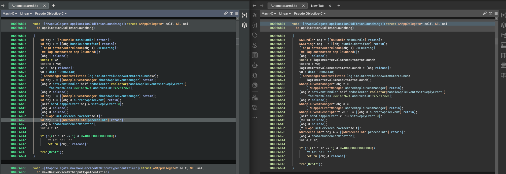
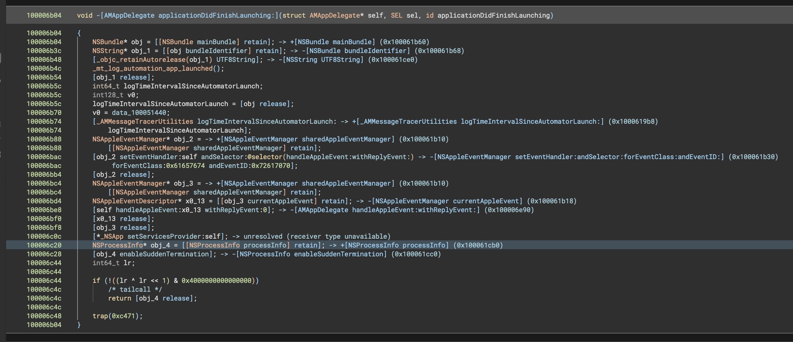
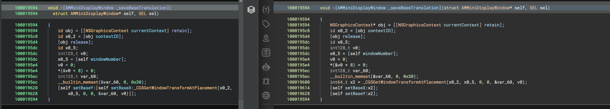
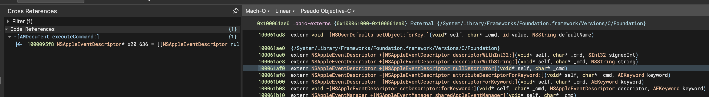

# workflow_objc 

objc externs, accurate dynamic call rewriting, more type information. etc.

[Install](#install)

---

warning: incompatible with built-in workflow_objc and definitely slower. this project liberally misuses workflows and 
requires several analysis passes to propagate types fully. IMO the speed loss is worth the benefits below.

warning2: wip homebrew crap liable to break, please file issues

warning3: this project is not affiliated with Vector 35 or Binary Ninja

---

this is a port of Binary Ninja's builtin workflow_objc that:
* Does a lot more type propagation in general
* Integrates with the Objective-C Type information in BinaryNinja's type libraries
* Creates externs whenever it encounters a call with a known type
* Fills those externs with information from type libraries when available
* assembles xrefs so complete it might as well be a C binary 

"can you tell me more in a format that allows you to post a ton of demo screenshots?" ofc ofc

### More Type Info:

<p align="center">
<i>before/after on a (cherry-picked) function with a lot of <br>typelibrary hits and external dispatch</i>
</p>

### Obscene amount of (accurate) call rewrites

while Binary Ninja's existing objc workflow can do some basic call rewriting whenever it
sees a dynamic dispatch call to a method with the same selector, this is prone to 
inaccuracy since it is guessing the type. because of this, that feature is disabled by default in the
built-in workflow.

by improving the type propagation a ton we are able to just know the type in most cases, and then
just confidently rewrite it :)


<p align="center">
<i>every '-> functionName' debug annotation here is a call that was rewritten.<br>clicking 
the selector in psuedo-objc will navigate you to the call rather than to the string.<br></i>
</p>

Having these accurate full-confidence call rewrites can directly improve IL output.


<p align="center">
<i>setBaseX does not return a value so should not be an arg in the following function :)</i>
</p>

### Objective-C Externs! with xrefs and typelib integration!

BinaryNinja's built in type libraries ship with Objective-C Type info and functions embedded, actually.

This workflow takes advantage of those by creating externs whenever it encounters a 
dynamic dispatch call, pulling the type info from the Type Library whenever it does so. 

It also call-rewrites to these externs and adds xrefs from call sites to the externs. callgraphs yay!




### Known Issues

* Variable names are occasionally less clear due to heavy IL mutation
* It can be slower due to requiring repeat analysis of things.
* BinaryNinja's built-in type libraries are not quite correct on objc methods returning class instances.
  * This plugin mitigates that issue currently, so this affects nothing
* Not everything gets resolved yet
  * There are a million different ways we can get type information to a dispatch, it is a lot easier as a human to recognize 
    propegatable type info than it is to programmatically do it. Expect this to improve over time. 

### Unknown issues 


<p align="center">
<i>where am i</i>
</p>

## Install

```shell
git clone https://github.com/0cyn/workflow_objc.git && cd workflow_objc
git submodule update --init --recursive
cmake -S . -B build -GNinja
cmake --build build -t install
```

## Install (prebuilt binaries)

Coming Soon:tm:


## Credits

This plugin is a continuation of [Objective Ninja](https://github.com/jonpalmisc/ObjectiveNinja),
originally made by [@jonpalmisc](https://twitter.com/jonpalmisc).

It at this point contains none of the original code so he is fully blameless for all problems. 

The full terms of the original Objective Ninja license are as follows:

```
Copyright (c) 2022-2023 Jon Palmisciano

Redistribution and use in source and binary forms, with or without modification,
are permitted provided that the following conditions are met:

1. Redistributions of source code must retain the above copyright notice, this
   list of conditions and the following disclaimer.

2. Redistributions in binary form must reproduce the above copyright notice,
   this list of conditions and the following disclaimer in the documentation
   and/or other materials provided with the distribution.

3. Neither the name of the copyright holder nor the names of its contributors
   may be used to endorse or promote products derived from this software without
   specific prior written permission.

THIS SOFTWARE IS PROVIDED BY THE COPYRIGHT HOLDERS AND CONTRIBUTORS "AS IS" AND
ANY EXPRESS OR IMPLIED WARRANTIES, INCLUDING, BUT NOT LIMITED TO, THE IMPLIED
WARRANTIES OF MERCHANTABILITY AND FITNESS FOR A PARTICULAR PURPOSE ARE
DISCLAIMED. IN NO EVENT SHALL THE COPYRIGHT HOLDER OR CONTRIBUTORS BE LIABLE FOR
ANY DIRECT, INDIRECT, INCIDENTAL, SPECIAL, EXEMPLARY, OR CONSEQUENTIAL DAMAGES
(INCLUDING, BUT NOT LIMITED TO, PROCUREMENT OF SUBSTITUTE GOODS OR SERVICES;
LOSS OF USE, DATA, OR PROFITS; OR BUSINESS INTERRUPTION) HOWEVER CAUSED AND ON
ANY THEORY OF LIABILITY, WHETHER IN CONTRACT, STRICT LIABILITY, OR TORT
(INCLUDING NEGLIGENCE OR OTHERWISE) ARISING IN ANY WAY OUT OF THE USE OF THIS
SOFTWARE, EVEN IF ADVISED OF THE POSSIBILITY OF SUCH DAMAGE.

```

The terms of the license the rust port is distributed under are as follows:

```
Copyright (c) 2015-2026 Vector 35 Inc

Permission is hereby granted, free of charge, to any person obtaining a copy
of this software and associated documentation files (the "Software"), to
deal in the Software without restriction, including without limitation the
rights to use, copy, modify, merge, publish, distribute, sublicense, and/or
sell copies of the Software, and to permit persons to whom the Software is
furnished to do so, subject to the following conditions:

The above copyright notice and this permission notice shall be included in
all copies or substantial portions of the Software.

THE SOFTWARE IS PROVIDED "AS IS", WITHOUT WARRANTY OF ANY KIND, EXPRESS OR
IMPLIED, INCLUDING BUT NOT LIMITED TO THE WARRANTIES OF MERCHANTABILITY,
FITNESS FOR A PARTICULAR PURPOSE AND NONINFRINGEMENT. IN NO EVENT SHALL THE
AUTHORS OR COPYRIGHT HOLDERS BE LIABLE FOR ANY CLAIM, DAMAGES OR OTHER
LIABILITY, WHETHER IN AN ACTION OF CONTRACT, TORT OR OTHERWISE, ARISING
FROM, OUT OF OR IN CONNECTION WITH THE SOFTWARE OR THE USE OR OTHER DEALINGS
IN THE SOFTWARE.
```

It's probably best to assume this project falls under both these licenses. I'm not a lawyer.

This iteration is based upon my own C++ port of Vector35's rust port of the original C++ plugin.

Any issues with this c++ plugin can be assumed to be the fault of github/0cyn. 

### why is this C++

i don't know rust 
